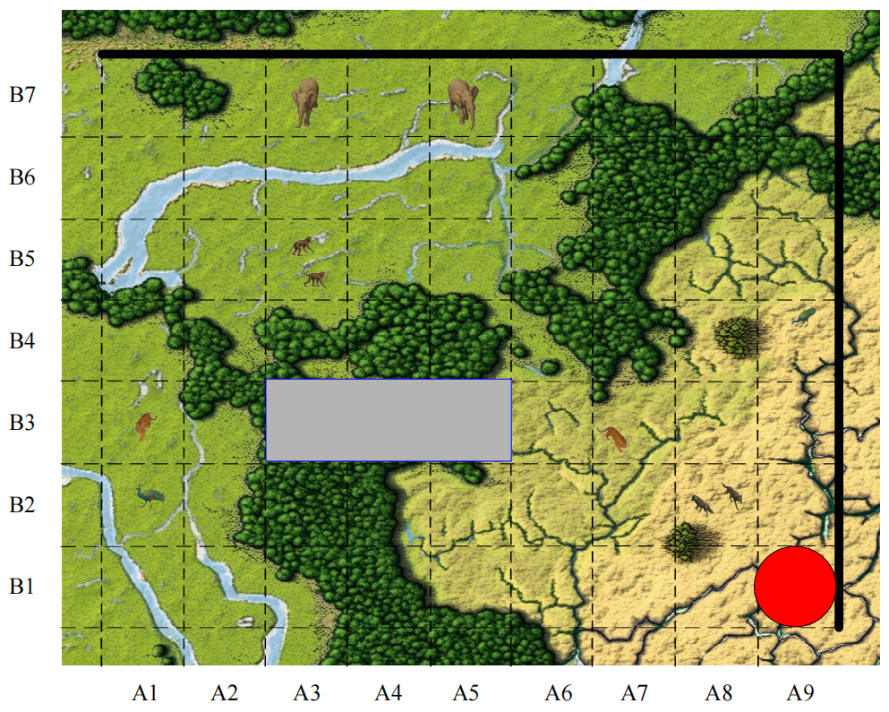
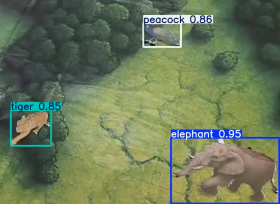
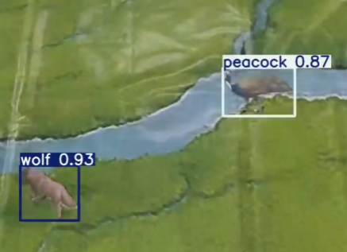

# YOLO野生动物巡查系统 - 视觉任务

## 项目简介

本项目为**2025年全国大学生电子设计大赛H题**——野生动物巡查系统的视觉识别部分。使用多旋翼自主飞行无人机巡查450cm×350cm区域，识别、统计区域内野生动物类型、所在位置及各种动物的数量。

### 任务要求
- 巡查区域：450cm×350cm，划分为63个50cm×50cm方格
- 识别动物：象、虎、狼、猴、孔雀等野生动物
- 禁飞区：灰色矩形区域，测试时现场指定具体方格
- 系统组成：无人机 + 地面站（含微控制器、显示屏、按键输入设备）
- 指示方式：无人机下方安装激光笔垂直向下指示航线

 \
命题H：[野生动物巡查系统](photo_md/野生动物巡查系统.pdf)  
（点击链接可下载或在线查看）

## 数据集构建

### 1. 原始素材准备

**动物素材** (`objects/` 目录)：
- 包含15种动物及其不同形态的PNG图片
- 支持透明背景，便于合成
- 动物类别：象(elephant)、虎(tiger)、狼(wolf)、猴(monkey)、孔雀(peacock)

**背景素材** (`backgrounds/output_tiles/` 目录)：
- 63个50cm×50cm方格的背景图片
- 覆盖整个巡查区域的各种地貌

### 2. 数据集生成

使用 `data_final.py` 脚本自动生成训练数据集：

```python
# 主要配置参数
num_images = 500              # 生成图片数量
max_objects_per_image = 2     # 每张图片最大物体数
val_ratio = 0.2               # 验证集比例
max_rotation = 160            # 最大旋转角度
min_scale = 0.5               # 最小缩放比例
max_scale = 1.2               # 最大缩放比例
```

###  3. 数据集结构
yolo_dataset_final1.0/\
├── images/train/     # 训练集图片\
├── images/val/       # 验证集图片\
├── labels/train/     # 训练集标签\
├── labels/val/       # 验证集标签\
└── data.yaml         # 数据集配置

##  模型训练

### 1. 训练配置
使用 train.py 进行模型训练：
```python
# 训练参数配置
PRETRAINED_MODEL = 'runs/weights/best.pt'  # 预训练模型
DATASET_YAML = 'yolo_dataset_final1.0/data.yaml'  # 数据集配置

train_args = {
    'data': DATASET_YAML,
    'epochs': 150,
    'batch': 16,              # 批大小
    'imgsz': 640,             # 图像尺寸
    'lr0': 0.001,             # 学习率
    'device': '3',            # 使用GPU 3 (A6000)
    'workers': 8,             # 数据加载线程
    'augment': True,          # 数据增强
    'freeze': 10,             # 冻结层数
    'patience': 30,           # 早停轮次
    'dropout': 0.1,           # 防过拟合
    'optimizer': 'AdamW'      # 优化器
}
```

### 2. 训练环境
GPU: NVIDIA RTX A6000 × 4 \
CUDA: 12.4 \
框架: Ultralytics YOLO 8.3.226 \
Python: 3.10.4 \
PyTorch: 2.9.0+cu128 \

### 3.模型输出
训练完成后在 runs/weights/ 目录生成：\
best.pt - 最佳性能模型权重\
last.pt - 最后训练 epoch 的权重

### 4.实际检测效果

| 左图：识别情况1 | 右图：识别情况2 |
|------------------------|--------------------------|
|  |  |

**图例**：如上为未标注禁飞区的原始巡查区域（63个50cm×50cm方格）。
